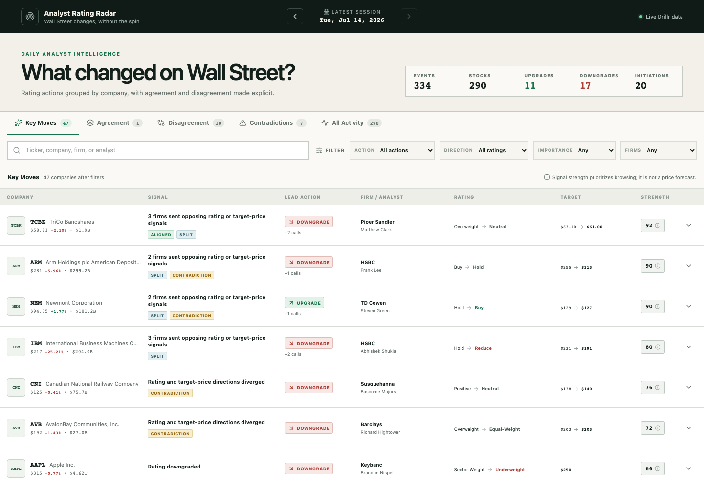

# Analyst Rating Radar

An open-source financial workbench for exploring the latest Wall Street analyst rating changes, multi-firm agreement, and market disagreement.

**[Open the live radar](https://analyst-rating-radar.vercel.app)**



Analyst Rating Radar answers one narrow question: **what did Wall Street analysts change?** It does not predict returns, explain price moves, or provide investment advice. Original firm labels and contradictory signals remain visible rather than being compressed into a black-box conviction score.

## What it surfaces

- **Key Moves** — upgrades, downgrades, and coverage initiations.
- **Multi-firm Agreement** — independent firms changing ratings in the same direction.
- **Disagreement** — different firms sending opposing rating or target-price signals.
- **Contradictions** — an upgrade paired with a lower target, or a downgrade paired with a higher target.
- **All Activity** — the complete session, grouped by ticker without losing individual calls.
- **Ticker detail** — current consensus and a 120-day analyst-rating timeline.

Search covers ticker, company, firm, and analyst. Filters cover action, mapped rating direction, importance, and single- versus multi-firm activity. The latest complete U.S. trading session is selected automatically.

## Transparent signal strength

Signal strength is a browsing priority, not a forecast. Its on-screen explanation lists every contributing factor:

- rating action type;
- the source `importance` value;
- additional material calls from independent firms;
- agreement, disagreement, or rating/target contradiction;
- a small browsing weight for widely followed companies.

Unverified target-price percentage changes never contribute. Large discontinuities, such as values that may cross a split or adjustment boundary, are flagged and shown only as context.

## Run locally

Requirements: Node.js 20.9 or newer and npm.

```bash
npm ci
npm run dev:fixture
```

Fixture mode contains synthetic versions of the validation cases and needs no credential. To use live data, copy `.env.example` to `.env.local`, set your own `DRILLR_API_KEY`, and run `npm run dev`.

```bash
npm run lint
npm run typecheck
npm test
npm run test:e2e
RADAR_DATA_MODE=fixture npm run build
```

## Data architecture

```text
Browser
  → Next.js server render
      → Drillr REST API / run_sql
      → normalization / grouping / scoring / cache
  → interactive workbench
```

The server reads three Drillr tables:

| Table | Purpose |
|---|---|
| `analyst_ratings` | Individual rating and target-price events |
| `analyst_ratings_consensus` | Rating distribution and consensus target |
| `company_snapshot` | Company name, current price, return, and market capitalization |

Daily sessions and ticker histories are cached by market date. If Drillr fails, production returns a clear error; it never presents a fixture or stale response as current data.

## Security

`DRILLR_API_KEY` is server-only. It is never placed in a `NEXT_PUBLIC_*` variable, browser request, HTML response, fixture, log, or committed environment file. Public users cannot submit SQL, and all date/ticker input is constrained before it reaches application-owned read-only queries.

See [SECURITY.md](SECURITY.md) for the complete boundary and private vulnerability-reporting link.

## License

MIT
